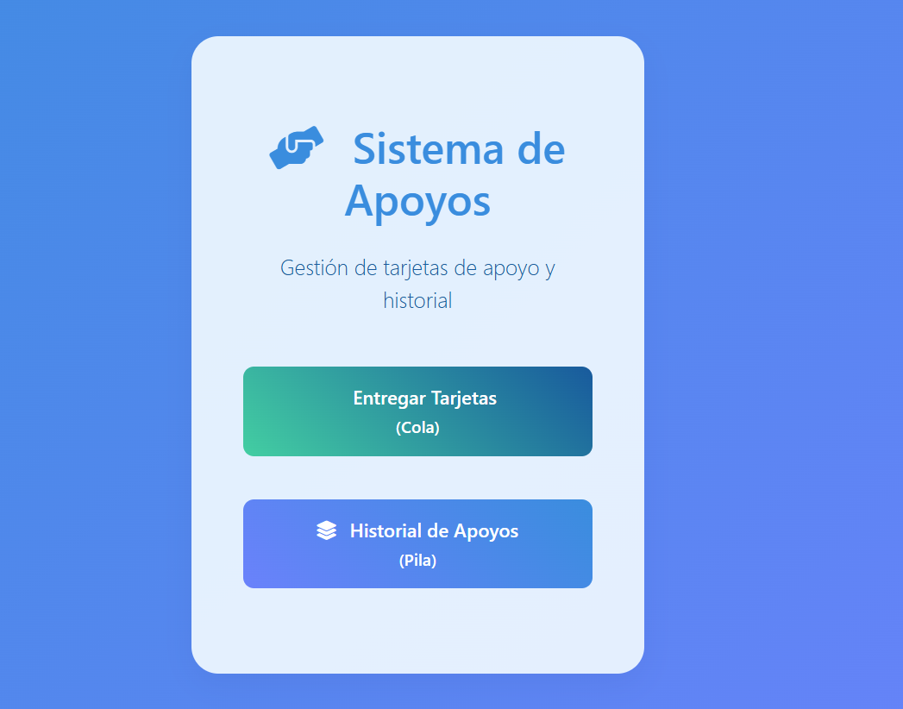

# 🎨 Sistema de Apoyos (Stack y Queue)

👤 **Autor:** Joel Orozco Joaquin  
📚 **Materia:** Estructura de Datos  
👥 **Grupo:** [Agrega tu grupo aquí]

---

## 🚀 Descripción del Proyecto

Este sistema es una aplicación web desarrollada en **Flask** que permite gestionar tarjetas de apoyo y su historial utilizando estructuras de datos clásicas:

- **Cola (Queue):** Para la gestión de personas esperando su tarjeta de apoyo.
- **Pila (Stack):** Para el historial de apoyos, permitiendo deshacer acciones.

La interfaz es moderna y responsiva gracias a **Bootstrap**, permitiendo agregar, visualizar y eliminar elementos de manera intuitiva y visual.

---

## 🖥️ Características principales

- Añadir personas a la cola de apoyos.
- Procesar y eliminar personas de la cola.
- Añadir apoyos al historial (pila).
- Remover apoyos del historial o eliminar cualquier elemento individualmente.
- Interfaz visual atractiva y adaptada a dispositivos móviles.

---

## ⚙️ Instrucciones para instalar dependencias y ejecutar el sistema

```bash
# 1. (Opcional) Crea un entorno virtual
python -m venv venv
source venv/bin/activate  

# 2. Instala las dependencias
pip install -r requirements.txt

# 3. Ejecuta la aplicación
python app.py

# 4. Abre tu navegador en
http://localhost:5000
```
## 📸 Vista previa




---

## ⚙️ Tecnologías utilizadas

- Python 3
- Flask
- Bootstrap 5
- HTML5 + CSS3

---


